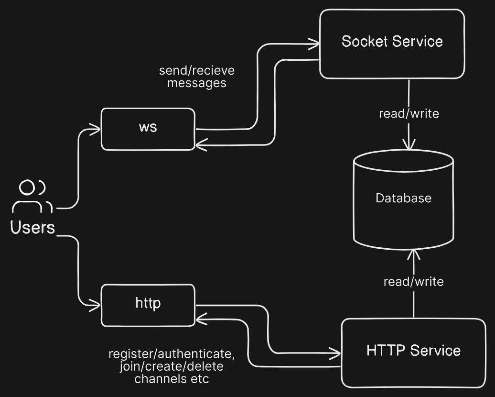

Recently, I came across Juraj Majerik's [Blog](https://jurajmajerik.com/), where he has documented his entire process of building a side project called ["rides"](https://rides.jurajmajerik.com/). After reading the whole process, it inspired me to start my own project and document the journey through a series of blog posts.

My aim is to develop a simplified Discord clone, and through this project, I want to learn a set of technologies. Such as Go Lang, Docker, concepts of Distributed Systems and DevOps, and AWS.

Why discord clone? Well, I was watching ThePrimeAgen's video [1 TRILLION Messages on Discord](https://youtu.be/U2xHdvvDQyI?si=WvZKHKNd-DfCpUp2) where he is reading an article [How Discord Stores Trillions of Messages](https://discord.com/blog/how-discord-stores-trillions-of-messages). I read the article myself and also read their 2017 article [How Discord stores billions of messages](https://discord.com/blog/how-discord-stores-billions-of-messages) and it made me interested in understanding how large organizations scale.

Of course, my Discord clone will not be as complex and certainly won't be able to handle billions or trillions of messages like the real Discord platform. However, I'll try to create something similar to learn the stuff that mentioned above.

Now, let's talk about our project. Our project will be divided into four main components:

1. UI: The user interface will display registration and login forms, channels, messages, etc.
2. Http Server: Responsible for managing API requests such as user registration, authentication, and channel creation.
3. Socket Server: Responsible real time communication.
4. Database:This will store user data, channel information, and messages.

We've settled on React.js for the frontend. It's a library I'm already comfortable with, and while I'm eager to learn SvelteJS, SolidJS, VueJS, or whatever new blazingly fast frameworks are dropping every day, diving into another JavaScript framework isn't part of the plan for this project. Perhaps that's something to consider for another occasion.

For our backend, we'll use Go. As mentioned earlier, Go is a programming language I aim to learn through this project.

As for data storage, we have options like MongoDB (a NoSQL database) or PostgreSQL (a relational database). However, given that we're building a Discord clone, I've opted to use Cassandra DB, which Discord used in 2017.

We can visualize the backend architecture using the following diagram. I might include more things in future as needed and update the diagram later on.



Here's the schema to outline our app's database structure, which I generated with ChatGPT. It's only for providing a general overview and therefor it lacks specific columns such as avatar URLs and user bios. However, as we progress, these elements will be added into the schema.

```cql
CREATE TABLE IF NOT EXISTS chat_app.users (
    user_id UUID PRIMARY KEY,
    username TEXT,
    email TEXT,
    password TEXT,
    created_at TIMESTAMP
);

CREATE TABLE IF NOT EXISTS chat_app.channels (
    channel_id UUID PRIMARY KEY,
    channel_name TEXT,
    created_by UUID,
    created_at TIMESTAMP
);

CREATE TABLE IF NOT EXISTS chat_app.channel_members (
    channel_id UUID,
    user_id UUID,
    PRIMARY KEY (channel_id, user_id)
);

CREATE TABLE IF NOT EXISTS chat_app.messages (
    message_id UUID,
    sender_id UUID,
    channel_id UUID,
    message_content TEXT,
    sent_at TIMESTAMP,
    PRIMARY KEY (channel_id, message_id)
) WITH CLUSTERING ORDER BY (message_id DESC);

```

I'll write detailed explanations about the models and queries as we will deal with them during the development phase. As It will be my first time using Cassandra, I don't have much idea about it right now.

There might be other things I could be missing at this point. However, we'll tackle them as they arise and address any additional requirements as needed during the development process.

Admittedly, I don't know anything about distributed systems other than the definition. And I have yet to return "Hello World" from a Go server. However, I will learn about everything through this project. This is the beginning of the long journey.

So, let the adventure begin .
